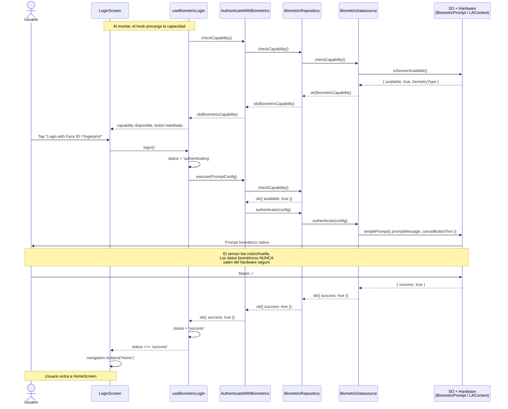
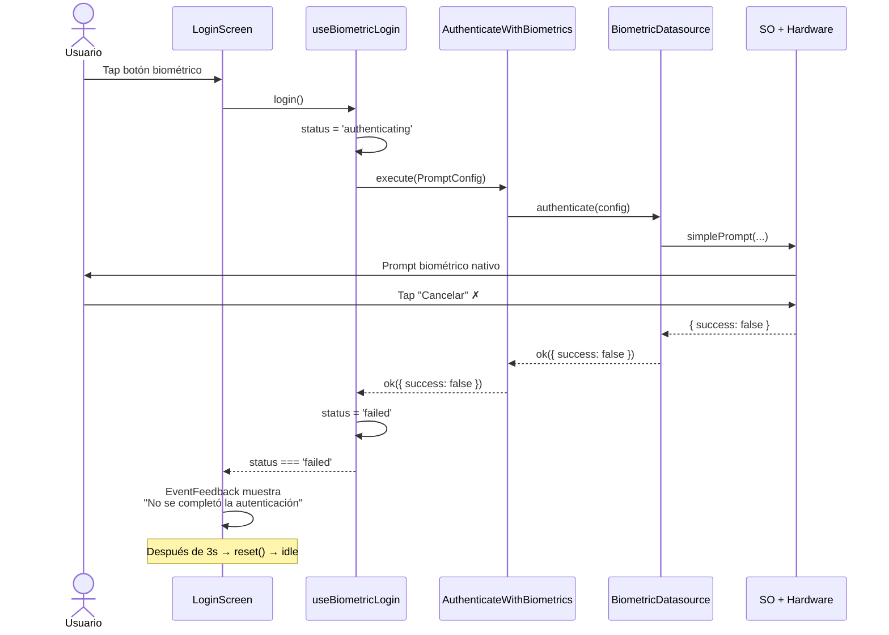
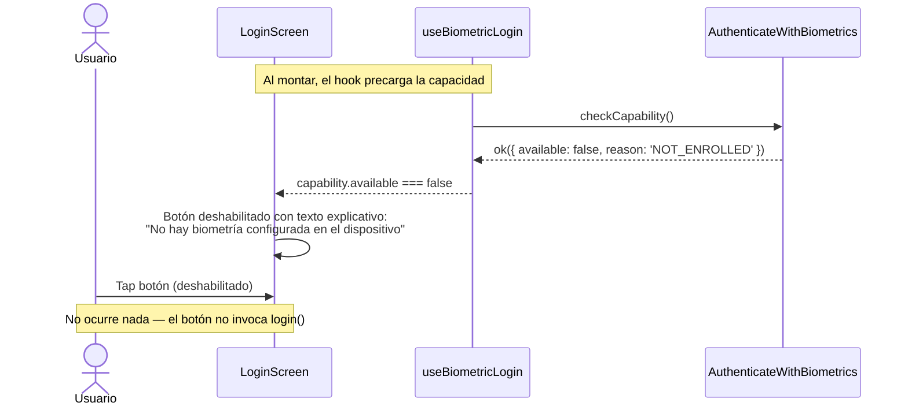

# Design Document

## Overview

This design implements biometric authentication for the simulated banking app: the user presses a button on Login, the OS biometric prompt appears, and on success the app navigates to a Home screen. The architecture extends the existing Clean Architecture by adding an `authenticate()` method to the domain BiometricRepository, introducing an `AuthenticateWithBiometrics` use case, and replacing the current `useState`-based navigation with React Navigation native-stack.

## Architecture

```
┌────────────────────────────────────────────────────────────────────┐
│  presentation/features/auth/                                       │
│  ┌─────────────┐  ┌────────────┐  ┌──────────────────────────┐   │
│  │ LoginScreen │  │ HomeScreen │  │ EventFeedbackComponent   │   │
│  └──────┬──────┘  └────────────┘  └──────────────────────────┘   │
│         │                                                          │
│  ┌──────▼──────────────────┐                                      │
│  │  useBiometricLogin hook │                                      │
│  └──────┬──────────────────┘                                      │
├─────────┼──────────────────────────────────────────────────────────┤
│  domain │                                                          │
│  ┌──────▼──────────────────────────┐                              │
│  │ AuthenticateWithBiometrics UC   │                              │
│  │  → CheckBiometricCapability     │                              │
│  │  → BiometricRepository.auth()  │                              │
│  └──────┬──────────────────────────┘                              │
├─────────┼──────────────────────────────────────────────────────────┤
│  data   │                                                          │
│  ┌──────▼──────────────────────────┐                              │
│  │ BiometricRepositoryImpl         │                              │
│  │  → BiometricDatasource.auth()  │                              │
│  │  → react-native-biometrics     │                              │
│  └─────────────────────────────────┘                              │
└────────────────────────────────────────────────────────────────────┘
```

## Sequence Diagrams

### Happy Path: Login biométrico exitoso



### Cancelación: usuario cierra el prompt



### Error: biometría no disponible (botón deshabilitado)



## Components and Interfaces

### 1. Domain Layer Extensions

#### 1.1 New Entities — `domain/biometrics/entities/biometric-auth.ts`

```typescript
export interface PromptConfig {
  readonly title: string;
  readonly cancelLabel: string;
}

export interface BiometricAuthResult {
  readonly success: boolean;
}
```

`PromptConfig` carries the text displayed on the native dialog. `BiometricAuthResult` is intentionally minimal — success or not. Fine-grained error codes come in spec 04.

#### 1.2 Extended Repository Interface — `domain/biometrics/repositories/biometric.repository.ts`

```typescript
import { Result } from '@core/types/result';
import { AppError } from '@core/errors/app-error';
import { BiometricCapability } from '../entities/biometric-capability';
import { PromptConfig, BiometricAuthResult } from '../entities/biometric-auth';

export interface BiometricRepository {
  checkCapability(): Promise<Result<BiometricCapability, AppError>>;
  authenticate(config: PromptConfig): Promise<Result<BiometricAuthResult, AppError>>;
}
```

Adding `authenticate()` follows the existing pattern. It returns `Result<BiometricAuthResult, AppError>` — a system-level error (e.g., hardware crash) is `err`; the user failing biometric or cancelling is `ok({ success: false })`.

#### 1.3 Use Case — `domain/biometrics/usecases/authenticate-with-biometrics.ts`

```typescript
import { Result, ok, err } from '@core/types/result';
import { AppError } from '@core/errors/app-error';
import { BiometricAuthResult, PromptConfig } from '../entities/biometric-auth';
import { BiometricRepository } from '../repositories/biometric.repository';

export class AuthenticateWithBiometricsUseCase {
  constructor(private readonly repository: BiometricRepository) {}

  async execute(config: PromptConfig): Promise<Result<BiometricAuthResult, AppError>> {
    const capabilityResult = await this.repository.checkCapability();

    if (capabilityResult.kind === 'err') {
      return capabilityResult;
    }

    if (!capabilityResult.value.available) {
      return err(
        new AppError(
          'BIOMETRIC_NOT_AVAILABLE',
          `Biometric not available: ${capabilityResult.value.reason}`,
        ),
      );
    }

    return this.repository.authenticate(config);
  }
}
```

**Business rule**: The use case gates on capability before invoking the prompt. This prevents the native prompt from appearing when the device has no hardware or no enrolled biometrics — the UI should disable the button, but the domain enforces it independently as a safety net.

### 2. Data Layer Extensions

#### 2.1 Datasource — `data/biometrics/datasources/biometric.datasource.ts` (extend)

```typescript
// Add to existing BiometricDatasource class:

async authenticate(config: PromptConfig): Promise<Result<BiometricAuthResult, AppError>> {
  try {
    const { success } = await this.rnBiometrics.simplePrompt({
      promptMessage: config.title,
      cancelButtonText: config.cancelLabel,
    });

    return ok({ success });
  } catch (e: unknown) {
    return err(
      new AppError('BIOMETRIC_NOT_AVAILABLE', 'Biometric prompt failed', e),
    );
  }
}
```

`react-native-biometrics` `simplePrompt` returns `{ success: boolean }`. User cancellation results in `success: false` — not an exception. Actual exceptions represent system-level failures (activity destroyed, hardware error).

#### 2.2 Repository Implementation — `data/biometrics/repositories/biometric.repository.impl.ts` (extend)

```typescript
// Add to existing BiometricRepositoryImpl:

authenticate(config: PromptConfig): Promise<Result<BiometricAuthResult, AppError>> {
  return this.datasource.authenticate(config);
}
```

### 3. Presentation Layer

#### 3.1 Navigation — `presentation/navigation/`

**New dependencies**: `@react-navigation/native`, `@react-navigation/native-stack`, `react-native-screens`.

```typescript
// presentation/navigation/types.ts
export type RootStackParamList = {
  Login: undefined;
  Home: undefined;
};

// presentation/navigation/AppNavigator.tsx
import React from 'react';
import { NavigationContainer } from '@react-navigation/native';
import { createNativeStackNavigator } from '@react-navigation/native-stack';
import { LoginScreen } from '@presentation/features/auth/screens/LoginScreen';
import { HomeScreen } from '@presentation/features/auth/screens/HomeScreen';
import { RootStackParamList } from './types';

const Stack = createNativeStackNavigator<RootStackParamList>();

export function AppNavigator() {
  return (
    <NavigationContainer>
      <Stack.Navigator initialRouteName="Login" screenOptions={{ headerShown: false }}>
        <Stack.Screen name="Login" component={LoginScreen} />
        <Stack.Screen name="Home" component={HomeScreen} />
      </Stack.Navigator>
    </NavigationContainer>
  );
}
```

This replaces the current `useState`-based routing entirely. `App.tsx` continues to wrap `<AppNavigator />` inside `<SafeAreaProvider>`.

#### 3.2 Auth State Machine Hook — `presentation/features/auth/hooks/useBiometricLogin.ts`

```typescript
import { useState, useEffect, useCallback } from 'react';
import { BiometricCapability } from '@domain/biometrics/entities/biometric-capability';
import { container } from '@di/container';

export type AuthStatus = 'idle' | 'authenticating' | 'success' | 'failed';

export interface UseBiometricLoginResult {
  status: AuthStatus;
  capability: BiometricCapability | null;
  login: () => void;
  reset: () => void;
}

export function useBiometricLogin(): UseBiometricLoginResult {
  const [status, setStatus] = useState<AuthStatus>('idle');
  const [capability, setCapability] = useState<BiometricCapability | null>(null);

  useEffect(() => {
    const loadCapability = async () => {
      const result = await container.checkBiometricCapabilityUseCase.execute();
      if (result.kind === 'ok') {
        setCapability(result.value);
      }
    };
    loadCapability();
  }, []);

  const login = useCallback(async () => {
    setStatus('authenticating');

    const result = await container.authenticateWithBiometricsUseCase.execute({
      title: 'Accede a tu banca móvil',
      cancelLabel: 'Cancelar',
    });

    if (result.kind === 'ok' && result.value.success) {
      setStatus('success');
    } else {
      setStatus('failed');
    }
  }, []);

  const reset = useCallback(() => {
    setStatus('idle');
  }, []);

  return { status, capability, login, reset };
}
```

**State transitions**:
- `idle` → (login called) → `authenticating`
- `authenticating` → (success) → `success`
- `authenticating` → (failure/error/cancel) → `failed`
- `failed` → (reset called) → `idle` (enables retry)

#### 3.3 LoginScreen — `presentation/features/auth/screens/LoginScreen.tsx`

```typescript
import React, { useEffect } from 'react';
import { View, Text, StyleSheet } from 'react-native';
import { useNavigation } from '@react-navigation/native';
import { NativeStackNavigationProp } from '@react-navigation/native-stack';
import { RootStackParamList } from '@presentation/navigation/types';
import { useBiometricLogin } from '../hooks/useBiometricLogin';
import { BiometricButton } from '../components/BiometricButton';
import { EventFeedback } from '../components/EventFeedback';

type LoginNav = NativeStackNavigationProp<RootStackParamList, 'Login'>;

export function LoginScreen() {
  const navigation = useNavigation<LoginNav>();
  const { status, capability, login, reset } = useBiometricLogin();

  useEffect(() => {
    if (status === 'success') {
      navigation.replace('Home');
    }
  }, [status, navigation]);

  useEffect(() => {
    if (status === 'failed') {
      const timeout = setTimeout(reset, 3000);
      return () => clearTimeout(timeout);
    }
  }, [status, reset]);

  return (
    <View style={styles.container}>
      <Text style={styles.title}>Banca Móvil</Text>
      <BiometricButton
        capability={capability}
        status={status}
        onPress={login}
      />
      <EventFeedback status={status} />
    </View>
  );
}
```

Navigation uses `replace` (not `push`) so the user cannot swipe back to Login from Home.

#### 3.4 HomeScreen — `presentation/features/auth/screens/HomeScreen.tsx`

```typescript
import React from 'react';
import { View, Text, TouchableOpacity } from 'react-native';
import { useNavigation, CommonActions } from '@react-navigation/native';
import { NativeStackNavigationProp } from '@react-navigation/native-stack';
import { RootStackParamList } from '@presentation/navigation/types';

type HomeNav = NativeStackNavigationProp<RootStackParamList, 'Home'>;

export function HomeScreen() {
  const navigation = useNavigation<HomeNav>();

  const handleLogout = () => {
    navigation.dispatch(
      CommonActions.reset({ index: 0, routes: [{ name: 'Login' }] }),
    );
  };

  return (
    <View>
      <Text>Saldo disponible: $12,500.00</Text>
      <TouchableOpacity onPress={handleLogout}>
        <Text>Cerrar sesión</Text>
      </TouchableOpacity>
    </View>
  );
}
```

Logout resets the navigation state completely, preventing back navigation to Home.

#### 3.5 BiometricButton — `presentation/features/auth/components/BiometricButton.tsx`

```typescript
import React from 'react';
import { TouchableOpacity, Text, ActivityIndicator } from 'react-native';
import { BiometricCapability } from '@domain/biometrics/entities/biometric-capability';
import { AuthStatus } from '../hooks/useBiometricLogin';

interface Props {
  capability: BiometricCapability | null;
  status: AuthStatus;
  onPress: () => void;
}

export function BiometricButton({ capability, status, onPress }: Props) {
  const isDisabled = !capability?.available || status === 'authenticating';
  const label = getButtonLabel(capability);

  return (
    <TouchableOpacity
      onPress={onPress}
      disabled={isDisabled}
      accessibilityRole="button"
      accessibilityState={{ disabled: isDisabled }}
    >
      {status === 'authenticating' ? (
        <ActivityIndicator />
      ) : (
        <Text>{label}</Text>
      )}
      {!capability?.available && capability && (
        <Text>{getDisabledExplanation(capability.reason)}</Text>
      )}
    </TouchableOpacity>
  );
}

function getButtonLabel(capability: BiometricCapability | null): string {
  if (!capability || !capability.available) {
    return 'Login biométrico no disponible';
  }
  if (capability.biometryType === 'FaceID') {
    return 'Login with Face ID';
  }
  return 'Login with fingerprint';
}

function getDisabledExplanation(reason: string): string {
  switch (reason) {
    case 'NO_HARDWARE':
      return 'Este dispositivo no tiene sensor biométrico';
    case 'NOT_ENROLLED':
      return 'No hay biometría configurada en el dispositivo';
    default:
      return 'Biometría no disponible';
  }
}
```

#### 3.6 EventFeedback — `presentation/features/auth/components/EventFeedback.tsx`

```typescript
import React from 'react';
import { View, Text } from 'react-native';
import { AuthStatus } from '../hooks/useBiometricLogin';

interface Props {
  status: AuthStatus;
}

export function EventFeedback({ status }: Props) {
  if (status === 'idle') {
    return null;
  }

  const message = getStatusMessage(status);

  return (
    <View accessibilityLiveRegion="polite">
      <Text>{message}</Text>
    </View>
  );
}

function getStatusMessage(status: AuthStatus): string {
  switch (status) {
    case 'authenticating':
      return 'Verificando identidad...';
    case 'success':
      return 'Autenticación exitosa';
    case 'failed':
      return 'No se completó la autenticación. Intenta de nuevo.';
    default:
      return '';
  }
}
```

The component renders inline on LoginScreen (not a modal/toast). Uses `accessibilityLiveRegion` for screen reader announcements.

### 4. DI Container Update — `di/container.ts`

```typescript
import { BiometricDatasource } from '@data/biometrics/datasources/biometric.datasource';
import { BiometricRepositoryImpl } from '@data/biometrics/repositories/biometric.repository.impl';
import { CheckBiometricCapabilityUseCase } from '@domain/biometrics/usecases/check-biometric-capability';
import { AuthenticateWithBiometricsUseCase } from '@domain/biometrics/usecases/authenticate-with-biometrics';

const biometricDatasource = new BiometricDatasource();
const biometricRepository = new BiometricRepositoryImpl(biometricDatasource);
const checkBiometricCapabilityUseCase = new CheckBiometricCapabilityUseCase(biometricRepository);
const authenticateWithBiometricsUseCase = new AuthenticateWithBiometricsUseCase(biometricRepository);

export const container = {
  checkBiometricCapabilityUseCase,
  authenticateWithBiometricsUseCase,
} as const;
```

## Data Models

### PromptConfig

| Field | Type | Description |
|-------|------|-------------|
| `title` | `string` | Text shown on native biometric dialog |
| `cancelLabel` | `string` | Text for the cancel/dismiss button |

### BiometricAuthResult

| Field | Type | Description |
|-------|------|-------------|
| `success` | `boolean` | Whether the biometric match was successful |

### AuthStatus (union type)

| Value | Meaning |
|-------|---------|
| `'idle'` | No authentication in progress |
| `'authenticating'` | Native prompt is showing |
| `'success'` | User authenticated successfully |
| `'failed'` | User failed, cancelled, or system error |

### RootStackParamList

| Route | Params | Description |
|-------|--------|-------------|
| `Login` | `undefined` | Initial login screen |
| `Home` | `undefined` | Post-auth banking screen |

## Error Handling

| Scenario | Result | User Experience |
|----------|--------|-----------------|
| Biometric match succeeds | `ok({ success: true })` | Navigate to Home |
| User cancels prompt | `ok({ success: false })` | Stay on Login, neutral message |
| Biometric match fails | `ok({ success: false })` | Stay on Login, neutral message |
| No hardware / not enrolled | `err(AppError)` | Button disabled, explanation shown |
| System-level exception | `err(AppError)` | Stay on Login, "failed" state |

The design intentionally flattens "cancel" and "biometric mismatch" into the same `success: false` path. Spec 04 will differentiate these with a richer error taxonomy.

## Testing Strategy

### Unit Tests (Jest with fakes)

**Use Case tests** — `domain/biometrics/usecases/__tests__/authenticate-with-biometrics.test.ts`:
- Fake `BiometricRepository` that returns configurable results
- Test: success path returns `ok({ success: true })`
- Test: failure path returns `ok({ success: false })`
- Test: unavailable capability returns `err(AppError)` without calling authenticate
- Test: system error propagation

**Hook tests** — `presentation/features/auth/hooks/__tests__/useBiometricLogin.test.ts`:
- Mock DI container use cases
- Test: initial state is "idle"
- Test: login transitions idle → authenticating → success
- Test: login transitions idle → authenticating → failed
- Test: reset transitions failed → idle

**Component tests** — `presentation/features/auth/components/__tests__/`:
- BiometricButton: disabled state for NO_HARDWARE/NOT_ENROLLED, correct label per biometry type
- EventFeedback: correct message per auth status

### Integration Tests (manual, both platforms)

- iOS Simulator: Features → Face ID → Enrolled, matching/non-matching face
- Android Emulator: fingerprint enrollment and auth via emulator extended controls

## Correctness Properties

*A property is a characteristic or behavior that should hold true across all valid executions of a system — essentially, a formal statement about what the system should do. Properties serve as the bridge between human-readable specifications and machine-verifiable correctness guarantees.*

### Property 1: Capability Gate

*For any* PromptConfig and *for any* BiometricCapability state, the AuthenticateWithBiometrics use case SHALL invoke the native prompt if and only if the capability indicates `available === true`. When `available === false`, it SHALL return a Result with kind "err" and SHALL NOT invoke the repository's `authenticate` method.

**Validates: Requirements 1.1, 1.2, 1.5**

### Property 2: Result Faithfulness

*For any* PromptConfig where capability is available, the AuthenticateWithBiometrics use case SHALL map the repository's authenticate response faithfully: if the repository returns `ok({ success: true })`, the use case returns `ok({ success: true })`; if the repository returns `ok({ success: false })`, the use case returns `ok({ success: false })`; if the repository returns `err(e)`, the use case returns `err(e)`.

**Validates: Requirements 1.3, 1.4**

### Property 3: State Machine Invariant

*For any* sequence of `login()` and `reset()` invocations on the useBiometricLogin hook with *any* combination of use case outcomes (success, failure, error), the `status` property SHALL always be exactly one of: `"idle"`, `"authenticating"`, `"success"`, or `"failed"`.

**Validates: Requirements 3.1**

### Property 4: State Machine Transitions

*For any* invocation of `login()` when the hook is in "idle" state, the status SHALL transition to "authenticating" before resolving. Upon resolution, *for any* successful authentication result, the status SHALL become "success"; *for any* failed authentication or error, the status SHALL become "failed".

**Validates: Requirements 3.4, 3.5, 3.6, 6.1, 6.3**

### Property 5: Re-authentication After Failure

*For any* scenario where the Auth_State_Machine reaches the "failed" state (including user cancellation), calling `reset()` followed by `login()` SHALL successfully transition through the full state machine cycle (idle → authenticating → success|failed) without errors or stale state.

**Validates: Requirements 6.1, 6.3**
