# Flujos de autenticación biométrica — Escenarios

Este documento evidencia gráficamente **todos los escenarios que la aplicación debe contemplar**, agrupados por tipo: satisfactorios, de error, de espera y de revocación. Cada diagrama referencia la spec donde se implementa. Los diagramas usan [Mermaid](https://mermaid.js.org/) y se renderizan directamente en GitHub y VS Code.

## Índice de escenarios

| # | Escenario | Tipo | Spec |
|---|-----------|------|------|
| 0 | [Mapa general de estados de la sesión](#0-mapa-general-de-estados-de-la-sesión) | Visión global | 03–06 |
| 1 | [Detección de capacidades del hardware](#1-detección-de-capacidades-del-hardware) | Satisfactorio / error | 02 |
| 2 | [Primer login y enrolamiento biométrico](#2-primer-login-y-enrolamiento-biométrico-opt-in) | Satisfactorio | 05 |
| 3 | [Login biométrico exitoso (challenge → firma → verificación)](#3-login-biométrico-exitoso) | Satisfactorio | 05 |
| 4 | [Errores durante el prompt biométrico](#4-errores-durante-el-prompt-biométrico) | Error | 04 |
| 5 | [Lockout temporal y permanente](#5-lockout-temporal-y-permanente) | Error / espera | 04 |
| 6 | [Invalidación de llaves por cambio de biometría](#6-invalidación-de-llaves-por-cambio-de-biometría-en-el-so) | Error / seguridad | 05 |
| 7 | [Espera: background, periodo de gracia y re-autenticación](#7-espera-background-periodo-de-gracia-y-re-autenticación) | Espera | 06 |
| 8 | [Revocación: logout, expiración y deshabilitar biometría](#8-revocación-logout-expiración-de-token-y-deshabilitar-biometría) | Revocación | 05–06 |
| 9 | [Step-up: autorización de transferencia](#9-step-up-autorización-de-una-transferencia) | Satisfactorio / error | 06 |
| 10 | [Anti-replay: challenge expirado, reusado y rate limiting](#10-anti-replay-challenge-expirado-reusado-y-rate-limiting) | Error / seguridad | 05 |

---

## 0. Mapa general de estados de la sesión

Visión de conjunto: todos los escenarios siguientes son transiciones dentro de esta máquina de estados.

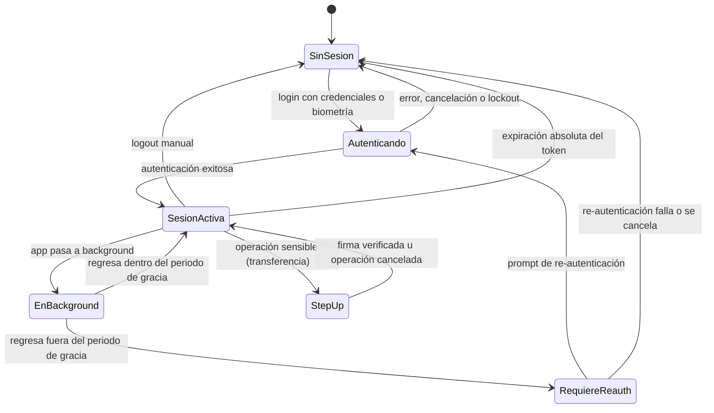

---

## 1. Detección de capacidades del hardware

**Spec 02.** Primer contacto con el hardware: la app nunca asume que hay biometría; consulta y reacciona a los tres estados posibles, distinguiendo además la clase de seguridad en Android.

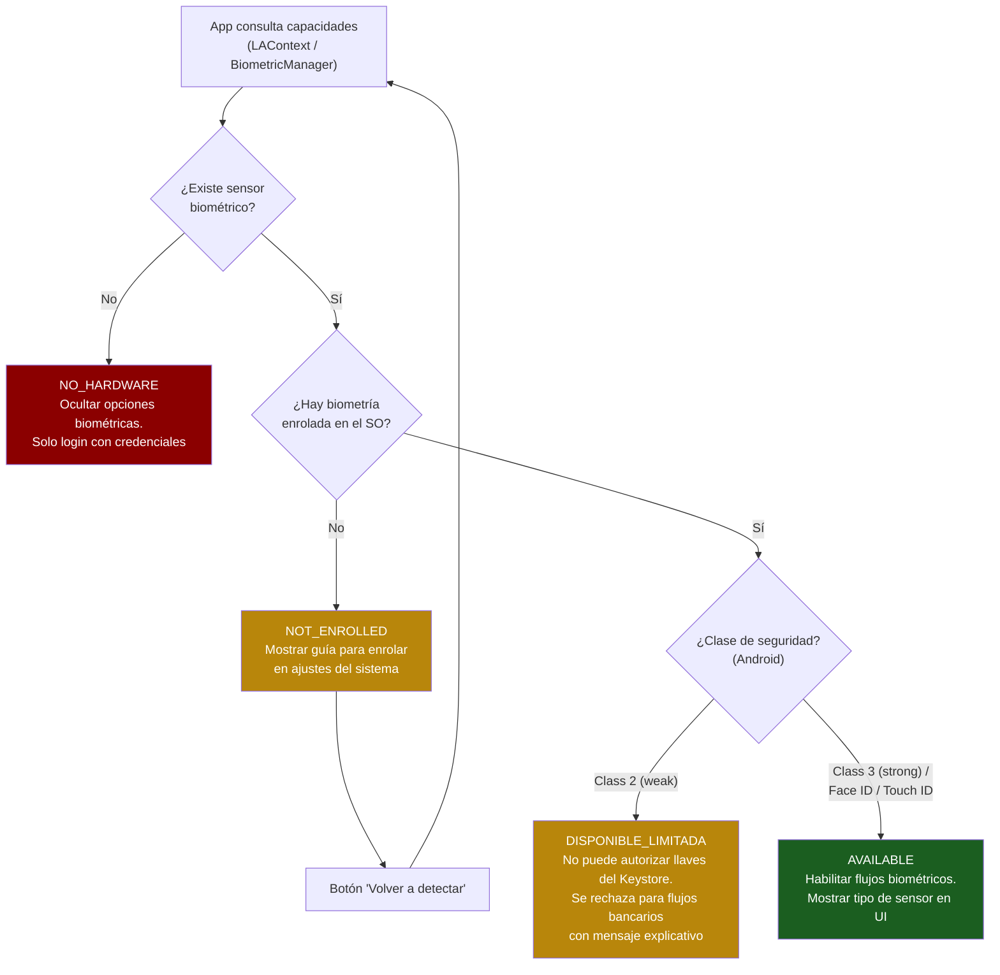

---

## 2. Primer login y enrolamiento biométrico (opt-in)

**Spec 05.** La biometría nunca se activa sola: el usuario entra primero con credenciales y decide habilitarla. Aquí nacen las llaves en el hardware seguro.

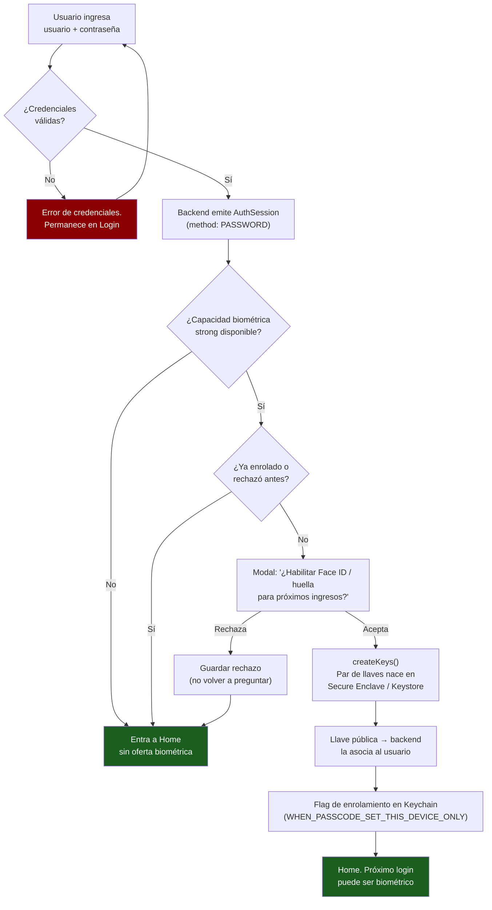

---

## 3. Login biométrico exitoso

**Spec 05.** El happy path completo. La clave del diseño: el éxito no es un booleano — es una **firma** que solo puede producirse si el hardware confirmó el match.

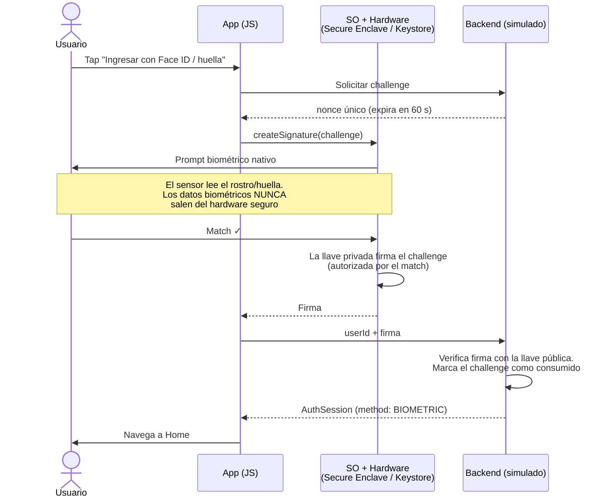

---

## 4. Errores durante el prompt biométrico

**Spec 04.** Taxonomía completa: cada salida del prompt exige una respuesta distinta. Tratar todo como "falló" es el anti-patrón que esta spec elimina. Incluye el escenario de espera "app interrumpida durante el prompt".

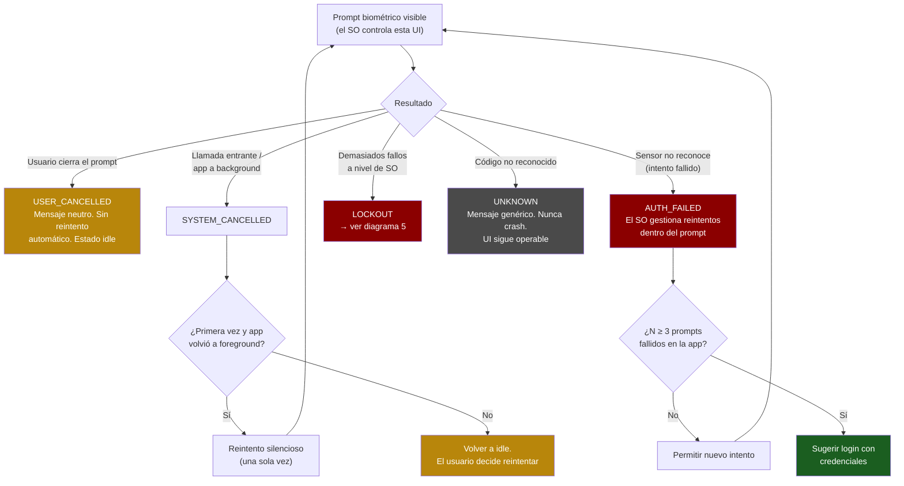

---

## 5. Lockout temporal y permanente

**Spec 04.** El bloqueo lo impone el **hardware/SO**, no la app: la app solo puede detectarlo, comunicarlo y ofrecer alternativas. Es un escenario de error *y* de espera.

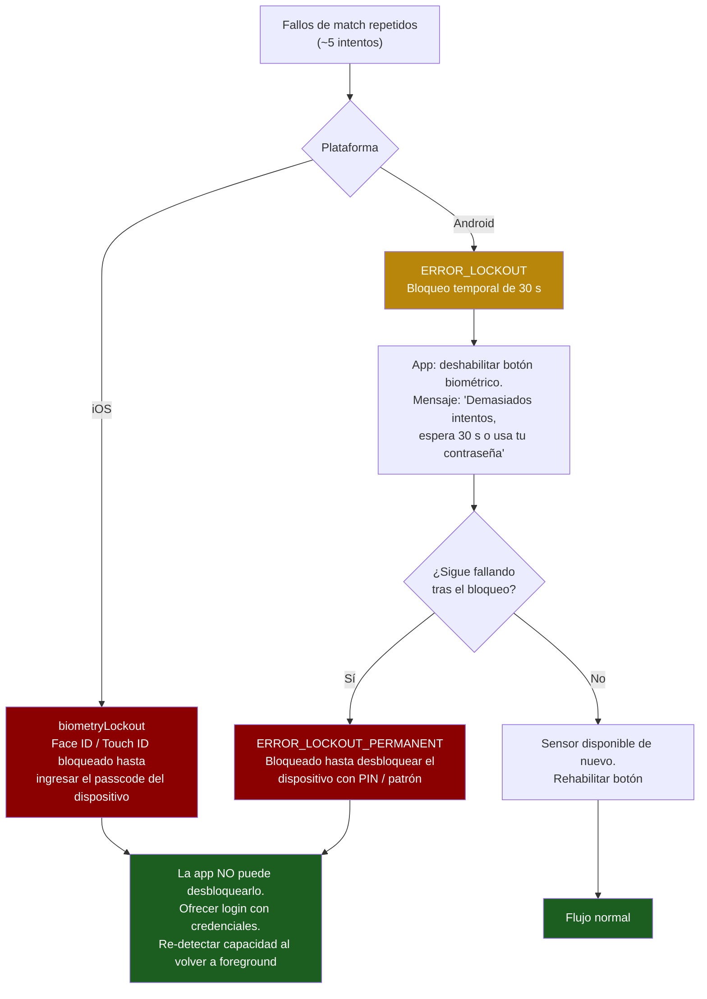

---

## 6. Invalidación de llaves por cambio de biometría en el SO

**Spec 05.** Escenario de seguridad crítico: alguien (o el propio usuario) enrola una nueva huella/rostro en el sistema. El hardware invalida las llaves a propósito — protege contra un tercero que, conociendo el PIN del dispositivo, agregue su huella para acceder al banco.

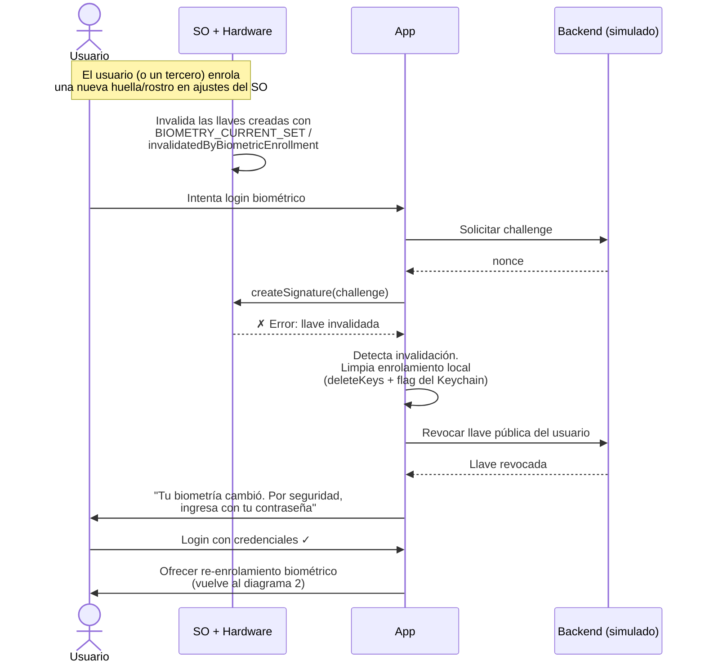

---

## 7. Espera: background, periodo de gracia y re-autenticación

**Spec 06.** La sesión es parte de la superficie de ataque: qué pasa cuando el usuario cambia de app y vuelve. El periodo de gracia balancea seguridad y fricción.

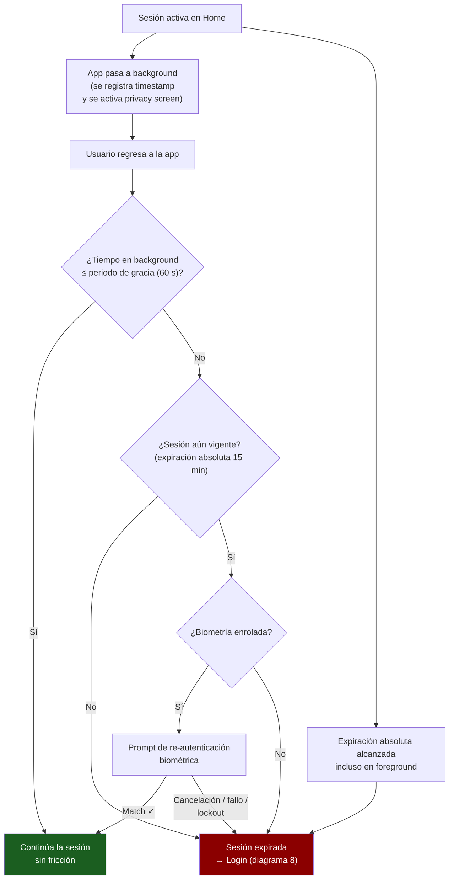

---

## 8. Revocación: logout, expiración de token y deshabilitar biometría

**Specs 05–06.** Tres disparadores distintos con limpiezas distintas. La diferencia clave: el logout conserva el enrolamiento biométrico; deshabilitar biometría destruye las llaves.

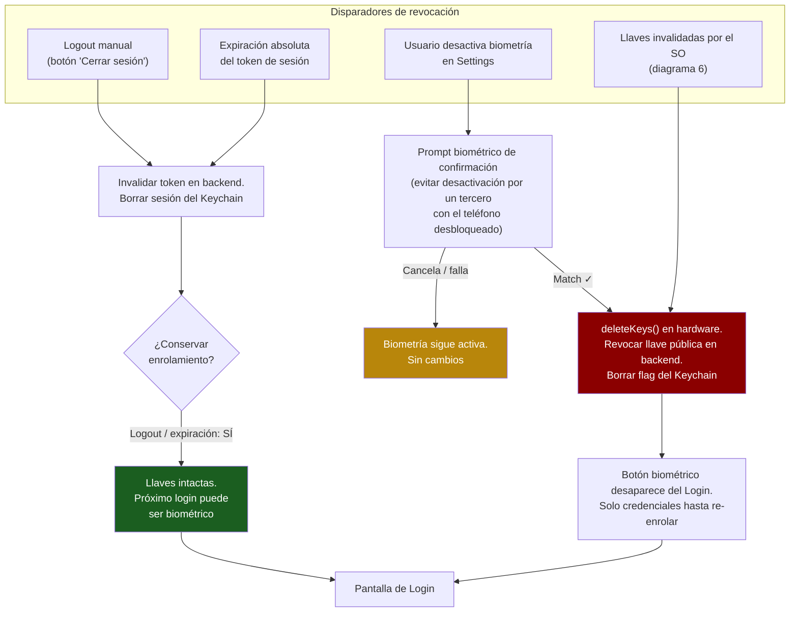

---

## 9. Step-up: autorización de una transferencia

**Spec 06.** Una sesión activa **no basta** para operaciones sensibles: cada transferencia exige su propio match biométrico (llave *auth-per-use*) y la firma cubre el payload de la operación — se aprueba *esta* transferencia, no un permiso genérico.

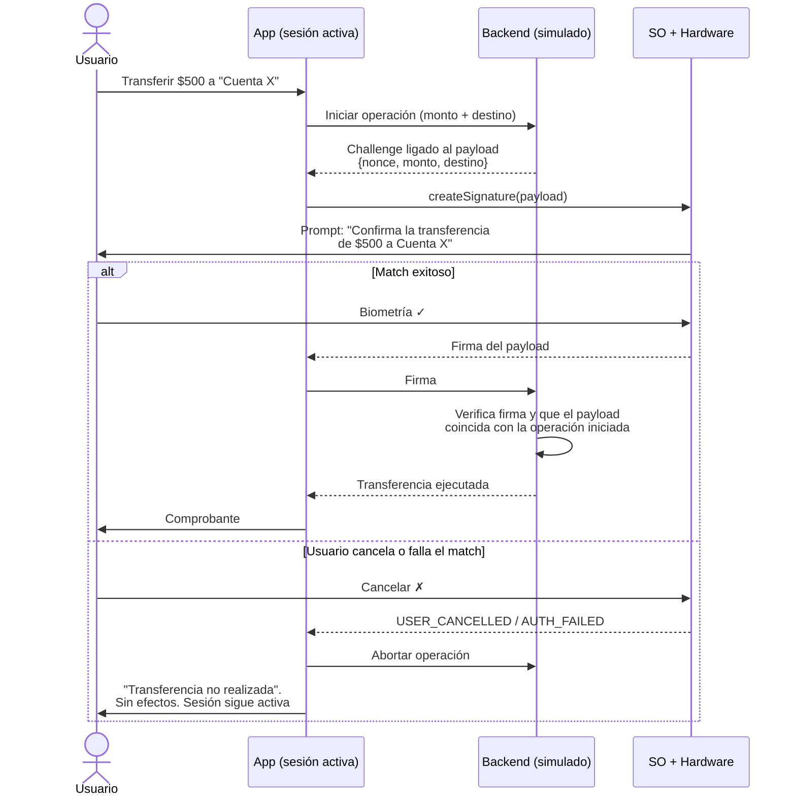

---

## 10. Anti-replay: challenge expirado, reusado y rate limiting

**Spec 05.** Las defensas del lado del "servidor": aunque el backend sea simulado, estas propiedades se implementan porque **son el aprendizaje** — la verdad siempre vive en el servidor, nunca en el cliente.

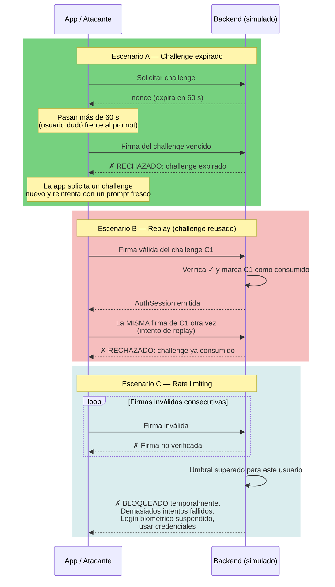

---

## Cobertura de escenarios por tipo

| Tipo | Escenarios cubiertos |
|------|---------------------|
| **Satisfactorios** | Detección exitosa (1), enrolamiento (2), login biométrico (3), re-auth dentro de gracia (7), transferencia autorizada (9) |
| **Error** | Sin hardware / sin enrolar / weak (1), credenciales inválidas (2), cancelaciones y fallos de match (4), lockout (5), llave invalidada (6), firma inválida (10) |
| **Espera** | Bloqueo temporal de 30 s (5), background + periodo de gracia (7), reintento silencioso tras interrupción del sistema (4), challenge expirado por duda del usuario (10) |
| **Revocación** | Logout, expiración de token, deshabilitar biometría, revocación de llave pública (8), invalidación por cambio biométrico (6) |
| **Seguridad / ataque** | Replay de firma (10), rate limiting (10), tercero agrega su huella (6), tercero intenta desactivar biometría (8) |

Si al implementar aparece un escenario no contemplado aquí, se agrega su diagrama a este documento en el mismo PR.
